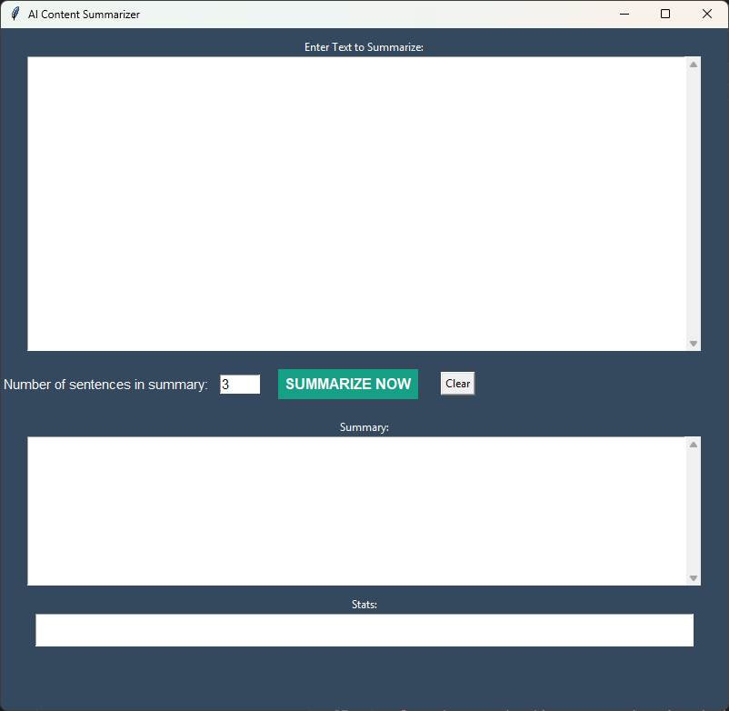

# AI Content Summarizer



An AI-powered desktop application that summarizes long articles, reports, or any block of text using Natural Language Processing to extract the most important sentences.

## Features
- Extractive text summarization using spaCy NLP
- Clean and intuitive GUI built with Tkinter
- Customizable summary length
- Word count statistics showing reduction percentage

## Technology Stack
- Python 3.x
- Tkinter (GUI)
- spaCy (NLP processing)

## Installation

1. **Install Python** (if not already installed):
   Download from [python.org](https://www.python.org/downloads/)

2. **Install required libraries**:
   ```bash
   pip install spacy
   python -m spacy download en_core_web_sm
   ```

3. **Download the application**:
   ```bash
   git clone https://github.com/yourusername/ai-content-summarizer.git
   cd ai-content-summarizer
   ```

## Usage

1. Run the application:
   ```bash
   python summarizer_app.py
   ```

2. Paste your text into the input area
3. Select the number of sentences for the summary (default: 3)
4. Click "SUMMARIZE NOW" to generate the summary
5. View the results in the summary area

## Contributing
Contributions are welcome! Please open an issue or pull request.

## License
This project is licensed under the MIT License - see the [LICENSE](LICENSE) file for details.